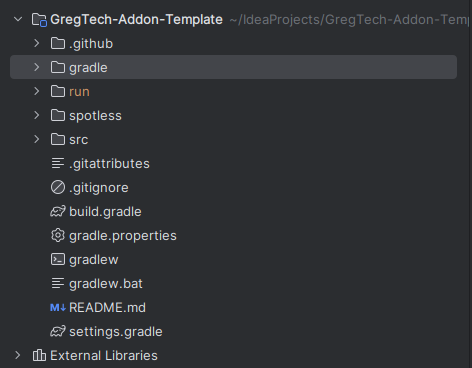

# Setting up an addon

## Before we begin

To reiterate for a third and final time, **you need to know Java** before making an addon. If you don't know already know it, take a few hours to learn it and come back.

While not required, knowing how to use GitHub will be useful too, especially if you intend to collaborate with other people during the development process.

Ready? Let's begin!

## Setting up your workspace

First, clone or download a ZIP of the [addon template](https://github.com/GregTechCEu/GregTech-Addon-Template). This comes prepackaged with all the required dependencies, and starter classes

If you're more experienced with Java, you can setup your mod from scratch too! 

!!! note "Required dependencies if you're not using the template"
    You will need to declare the following mods as dependencies in your project:

    - GTCEu Modern
    - LDLib
    - Registrate

    Optional, but useful dependencies:

    - Just Enough Items
    - EMI
    - Jade
    - Configuration (by Toma)

Open the cloned repo/unzipped folder into your IDE of choice (IntelliJ IDEA is highly recommended!)

Installing the [Minecraft Development plugin](https://plugins.jetbrains.com/plugin/8327-minecraft-development) is optional, but recommended as well.

### Quick changes

Your mod folder should look like this once its imported:


You will need to refactor a couple of things to your own namespace real quick!

1. Refactor the package in `src/main/java` from `com.example.examplemod` to your own or your organisation's namespace.
2. Change your mod id, obviously. You will need to change it in your mod's main class (the one annotated with `@Mod`), `gradle.properties`, `examplemod.mixins.json`, and `pack.mcmeta`
2. In your main class again, rename `EXAMPLE_REGISTRATE` to your own. We will be making extensive use of this field.

### The Main class

This is your mod's main class, and where you'll add listeners for your event bus and a couple of other things. Your materials, recipe types, machines, etc. are called and registered here.

### The GTAddon class

This is where your GT-related content is registered. You can override methods here to register custom tag prefixes, elements, sounds, recipe cabilities, recipes themselves, ore veins, and more here. You can also specify if your mod requires higher tier content (tiers above UV) here, though it is disabled by default.

This class needs to implement `IGTAddon`, and is required to have the following methods:

```java
@Override
public GTRegistrate getRegistrate() { // (1)
    return ExampleMod.EXAMPLE_REGISTRATE;
}

@Override
public void initializeAddon() {} // (2)

@Override
public String addonModId() { // (3)
    return ExampleMod.MOD_ID; 
}
```

1. Register your mod's GTRegistrate. This is how you'll register GT materials, machines, etc.
2. Loads your addon's custom GT content after GT itself has loaded, to prevent problems
3. Sets up the mod ID for your addon content. Make sure this is the same as your mod id in your Main class


A full list of available methods can be found [here](https://github.com/GregTechCEu/GregTech-Modern/blob/1.20.1/src/main/java/com/gregtechceu/gtceu/api/addon/IGTAddon.java)

### Registering your content

Most content in your addon (including recipes, machines, recipe types, items, etc.) will need to be called in your Main class or your GTAddon class at the appropriate event listener or override. This is usually done by calling an empty `init()` method from the required class.

??? example
    ```java title="CustomMaterials.java"
    public class CustomMaterials() {

        [...]

        public void init() {

        }
    }
    ```
    ```java title="ExampleMod.java"
    public ExampleMod() {
        [...]

        modEventBus.addListener(this::addMaterials);
    }

    [...]

    private void addMaterials(MaterialEvent event) {
        CustomMaterials.init();
    }
    ```
    
!!! note
    `init()` does NOT need to be empty, or even called `init()`. As long as any method from the appropriate class is called in the appropriate method, or registered in the appropriate event bus listener, it will register your content.
