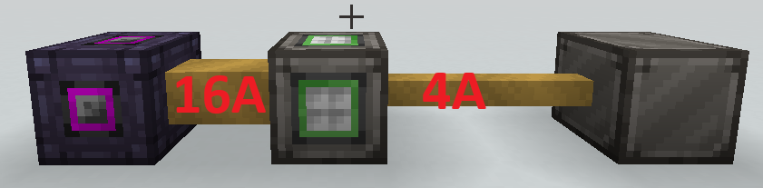

# GregTech Electricity

GregTech uses an energy system different from Forge Energy (FE) called Energy Units (EU). 1 EU converts to 4 FE, but FE cannot be converted to EU without a converter.

!!! note
    The conversion rate between EU and FE can be changed in the configs.

## Amperage and Voltage

EU comes in a system of _Voltages_ and _Amperages_.

Energy is transferred in packages. Voltage describes the size of the package, while Amperage describes how many packages are sent in parallel.

### Voltage

GregTech tiers progression into voltage tiers. The voltage tier of a generator defines the maximum EU the generator can output. The voltage tier of a single block machine or Energy Hatch describes the maximum amount of EU that it can recieve per amp. If this value is exceeded the machine explodes.

Certain recipes might require certain voltage levels, thus requiring a higher tier machine.

Each tier quadruples the EU value of the previous tier.

| Short Name | Long Name               | EU value      |
| ---------- | ----------------------- | ------------- |
| ULV        | Ultra Low Voltage       | 8             |
| LV         | Low Voltage             | 32            |
| MV         | Medium Voltage          | 128           |
| HV         | High Voltage            | 512           |
| EV         | Extreme Voltage         | 2,048         |
| IV         | Insane Voltage          | 8,192         |
| LuV        | Ludicrous Voltage       | 32,768        |
| ZPM        | ZPM Voltage             | 131,072       |
| UV         | Ultimate Voltage        | 524,288       |
| UHV        | Ultra High Voltage      | 2,097,152     |
| UEV        | Ultra Excessive Voltage | 8,388,608     |
| UIV        | Ultra Immense Voltage   | 33,554,432    |
| UXV        | Ultra Extreme Voltage   | 134,217,728   |
| OPV        | Overpowered Voltage     | 536,870,912   |
| MAX        | Maximum Voltage         | 2,147,483,640 |

### Amperage

Machines and energy hatches draw amps to fill their EU buffers. When running a recipe, the machine will draw from its internal buffer.

Different machines draw different amoun of amps:

| Machine                | Notes                                                |
| ---------------------- | ---------------------------------------------------- |
| Singleblock Generators | Outputs 1A of its tier                               |
| Energy Hatches         | Draws 2A (second amp mostly for extra draw for loss) |
| Transformers Step-Up   | Draws 4A lower voltage, outputs 1A higher voltage    |
| Transformers Step-Down | Draws 1A higher voltage, outputs 4A lower voltage    |
| Battery Buffers Draws  | 2A per Battery, outputs 1A per Battery.              |

## Machine Overclocking

Machines of a higher tier than that of the recipe's voltage level can overclock recipes to speed them up.
Overclocking doubles the recipe's speed, but quadruples EU/t usage. This is also called _2/4 overclock_ or _regular overclock_.
Single block machines can only regular overclock.

A _perfect overclock_ quadruples both the recipe's speed and EU/t usage.

Some multibocks suck as the Large Chemical Reactor do perfect overclocking by default, while some have conditional perfect overclocking.

Multiblocks with 2 Energy Hatches of the same Voltage Tier will overclock to 1 Amps of the Voltage Tier above. (For example, an Electric Blast Furncace with 2 LV Energy Hatches (4A of LV = 4 \_ 32 = 128 EU/t) will overclock to MV (1A of MV = 1 \* 128 = 128 EU/t).)

## Wires, Cables, Cable loss

In GregTech, energy is transferred trough wires and cables. Cables are the covered versions of wires, but anything mentioned about cables applies to wires too.

!!! warning
Non-superconductor wires will electrocute you if touched while electricity is flowing trough.

All cables have a max Voltage, max Amperage and a Loss/Meter/Ampere.

- Cables that recieve more EU than their maximum Voltage will burn up.
- Cables that have more Amps travelling through them than their maximum Amperage will burn up.

Each energy packet (Amp) travelling trough a cable will lose Voltage per block travelled. 
For example: Tin Cable can transfer 32 EU/t with a Cable Loss of 1 EU/Amps/Meter. This means, that 1 Amp can "live" for 32 blocks before it is lost.

Cables come in different density. A higher density can transfer a higher amount of Amps.

To account for cable loss, machines requiring large amounts of Amps (like the EBF), you should place these machines closer to your power use and use more dense cables. For example, an EBF that has 2 LV Energy Hatches requires 4A of LV, so using only 4A Tin Cables will barely be enough (it will be as most recipe Voltages account for some power loss) as even after travelling 1 block, each amp would already lose 1 EU.

!!! tip
Wires have twice the Cable Loss as Cables.

Superconductor Wires are Wires with 0 Cable Loss. These Wires don't have a cable wariant and won't electrocute you when touching them.

## Dynamo Hatches

Multiblock Generators use Dynamo Hatches to output electricity. Dynamo Hatches have 1A, 4A, 16A and 64A variants.

!!! note
    Multiblock Generators will always try to "fill" existing generated Amps before trying to generate more Amps.

## Transformers

Transformers can either transform 1 Amps of a higher Voltage into 4 Amps of a lower Voltage, or transform 4 Amps of a lower Voltage to 1 Amps of a higher Voltage. The Mode can be swapped by right-clicking with a Screwdriver.

Transformers come in 1-4, 2-8 and 4-16 versions.

### Active Transformer

The Active Transformer is a multiblock that can transform to and from any voltage, accepting energy with an Energy Hatch and outputting energy with a Dynamo Hatch.

## Diodes

Diode blocks can be used to limit the Amperage troughput of a network. A Diode has 5 input sides (green) and 1 output side (red). By default a Diode accepts and Amps and outputs 1 Amp. The output Amperage can be changed by right clicking with a Soft Mallet.

*An LV Diode taking 16A of LV power and outputting 4A of LV power to prevent the smaller cable from burning.*