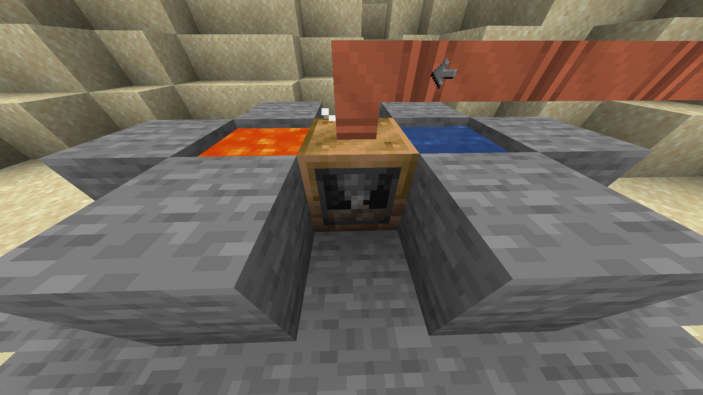

After you've generated some steam, you'll need some place to use it.
That's where the machines come in, they'll provide your first bit of automation and process some recipes cheaper and without needing durability.

### List of steam machines:
| Name         | Recipe types                | Examples                                       | Low Pressure| High Pressure|
| -------------| ----------------------------| -----------------------------------------------| --------| -------------|
| Extractor    | Extracting                  | Rubber Log -> Raw Rubber Pulp                  | 2 mB/t    | 4 mB/t    |
| Macerator    | Macerating/Ore Grinding     | Copper Ingot -> Copper dust/Copper Ore -> Crushed Copper Ore, Byproducts| 2 mB/t    | 4 mB/t    |
| Compressor   | Compressing                 | Iron Ingot -> Block of Iron                    | 2 mB/t    | 4 mB/t    |
| Forge Hammer | Forge Hammer/Ore Crushing   | Iron Ingot -> Iron Plate/Crushed Cassiterite Ore -> Impure Pile of Cassiterite Dust| 16 mB/t   | 32 mB/t   |
| Furnace      | Smelting Ore                | Bronze Dust -> Bronze Ingot                    | 4 mB/t    | 8 mB/t    |
| Alloy Smelter| Alloy Smelting/Metal Molding| Copper Ingot, Tin Ingot -> Bronze Ingot/Iron Ingot, Casting Mold (Gear) -> Iron Gear| 16 mB/t   | 32 mB/t   |
| Rock Crusher | Rock Breaking               | Cobblestone, Water Source, Lava Source -> Cobblestone| 7 mB/t    | 14 mB/t   |
| Miner        | Mining                      | Mines from blocks in a 9x9 area. Generates Ores| 16 mB/t   | 32 mB/t   |
| Grinder      | Macerating/Ore Grinding     | Same as the Macerator, but Multiblock (Can process up to 8 recipes simultaneously)| 2 mB/t per recipe| - |
| Oven         | Smelting Ore                | Same as the Furnace, but Multiblock (Can process up to 8 recipes simultaneously)| 6 mB/t per recipe| - |

!!! info

### Special single block machines

The Rock Crusher and the Miner are special machines, since they don't process recipes quite the same as the others.

1. The Rock Crusher is a pseudo multiblock machine. It requires a Water source block and a Lava source block next to it. 

2. The Miner needs blocks infront of it in a given area, otherwise it couldn't mine and generate ores.